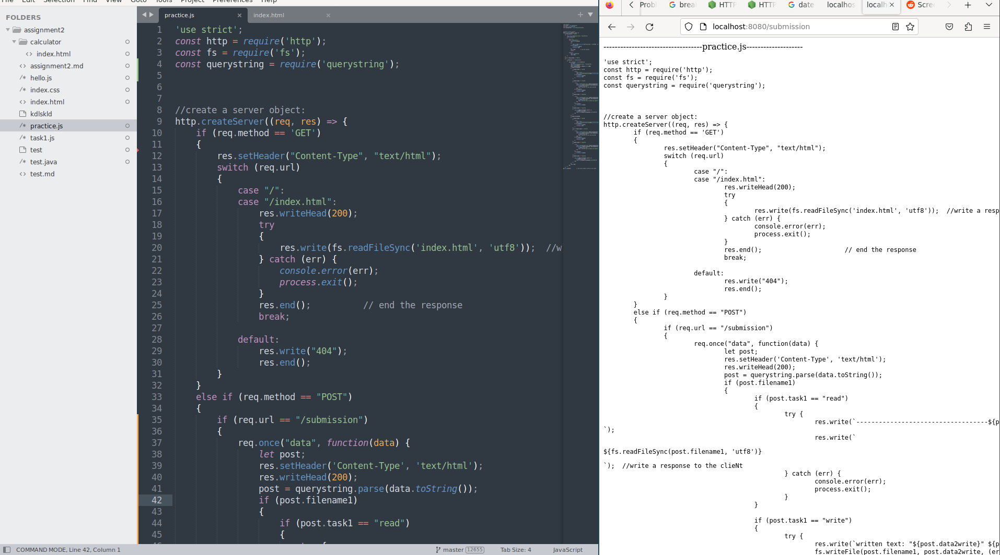

ll*Submitted by:* **Kushal**  
*Submitted to:* **Ketan Sabale**  
*Roll No:* **20BCP217**  
College Name: PDEU  


# NodeJS Code for File Read, Write, Append, Delete
```javascript
'use strict';
const http = require('http');
const fs = require('fs');
const querystring = require('querystring');


//create a server object:
http.createServer((req, res) => {
    if (req.method == 'GET')
    {
        res.setHeader("Content-Type", "text/html");
        switch (req.url) 
        {
            case "/":
            case "/index.html":
                res.writeHead(200);
                try 
                {
                    res.write(fs.readFileSync('index.html', 'utf8'));  //write a response to the client
                } catch (err) {
                    console.error(err);
                    process.exit();
                }
                res.end();          // end the response
                break;
            
            default:
                res.write("404");
                res.end();
        }
    }
    else if (req.method == "POST")
    {
        if (req.url == "/submission") 
        {
            req.once("data", function(data) {
                let post;
                res.setHeader('Content-Type', 'text/html');
                res.writeHead(200);
                post = querystring.parse(data.toString());
                if (post.filename1)
                {
                    if (post.task1 == "read")
                    {
                        try {
                            res.write(`-----------------------------------${post.filename1}--------------------<br>`);
                            res.write(`<html><body><pre>${fs.readFileSync(post.filename1, 'utf8')}</pre></body></html>`);  //write a response to the clieNt
                        } catch (err) {
                            console.error(err);
                            process.exit();
                        }                   
                    }
                    
                    if (post.task1 == "write")
                    {
                        try {
                            res.write(`written text: "${post.data2write}" ${post.filename1}`);
                            fs.writeFile(post.filename1, post.data2write, (err) => {
                                if (err) throw err;
                                res.write('The file has been saved');
                            });
                        } catch (err) {
                            console.error(err);
                            process.exit();
                        }
                    }
                    if (post.task1 == "append")
                    {
                        try {
                            res.write(`appended text: "${post.data2write}" ${post.filename2}`);
                            fs.appendFile(post.filename1, post.data2write, (err) => {
                                if (err) throw err;
                                res.write('The data to append was append to file!');
                            });
                        }
                        catch (err) {
                            console.error(err);
                        }
                    }
                    if (post.task1 == "delete")
                    {
                        fs.unlink(post.filename1, (err) => {
                            if (err) throw err;
                            res.write(`${post.filename1} was deleted`);
                        })
                    }
                }
                if (post.filename2)
                {
                    if (post.task1 == "read")
                    {
                        try {
                            res.write(`-----------------------------------${post.filename2}--------------------<br>`);
                            res.write(`<html><body><pre>${fs.readFileSync(post.filename2, 'utf8')}</pre></body></html>`);  //write a response to the clieNt
                        } catch (err) {
                            console.error(err);
                            process.exit();
                        }                   
                    }
                    else if (post.task1 == "write")
                    {
                        try {
                            res.write(`written text: "${post.data2write}" ${post.filename2}`);
                            fs.writeFile(post.filename2, post.data2write, (err) => {
                                if (err) throw err;
                                res.write('The file has been saved');
                            }); 
                        } catch (err) {
                            console.error(err);
                            process.exit();
                        }
                    }
                    if (post.task1 == "append")
                    {
                        try {
                            res.write(`appended text: "${post.data2write}" ${post.filename2}`);
                            fs.appendFile(post.filename2, post.data2write, (err) => {
                                if (err) throw err;
                                res.write('The data to append was append to file!');
                            });
                        }
                        catch (err) {
                            console.error(err);
                        }
                    }
                    if (post.task1 == "delete")
                    {
                        fs.unlink(post.filename2, (err) => {
                            if (err) throw err;
                            res.write(`${post.filename2} was deleted`);
                        });
                    }
                }
                res.end();
            });
        }
    }
}).listen(8080);            // the server object listens on port 8080
```

**Output**  



# NodeJS Code For Renaming File 
```javascript
function fun(myFun, str) {
    myFun(str);
    }
    fun( function(str){ console.log(str) }, "OK!" );
var fs = require("fs");
console.log("This is a sample to rename a file!");
fs.rename("aaa.txt", "bbb.txt", function(err) {
if (err) {
return console.error(err);
}
console.log("aaa.txt has renamed as bbb.txt successfully!");
});

console.log('You can see the next message in 6 seconds:')
```


# NodeJS Code for Multiple Event Execution
```javascript
var EventEmitter = require('events') 
var eventObj = new EventEmitter(); 
eventObj.on('delayEvent', function() { 
console.log('The event delays 6000 milliseconds');
});
setTimeout(function() { 
eventObj.emit('delayEvent'); 
}, 6000);
var events = require('events');

var eventObj = new events.EventEmitter();

eventObj.on('Event001', function(){
console.log('Event001 Done!');
});

eventObj.on('Event002', function(){
console.log('Event002 Done!');
});

eventObj.emit('Event001');

eventObj.emit('Event002');
console.log ("All events are done successfully!");

```

```javascript
var fs = require("fs"); 
var data = 'Read the File Stream: '; 
var obj = fs.createReadStream('mytext.txt');
obj.setEncoding('utf8'); 
obj.on('data', function(datas) { 
data += datas; 
});
obj.on('end',function(){ 
console.log(data);
});
obj.on('error', function(e){ 
console.log(e.stack); 
});
console.log("An example of reading a file stream");
```

```javascript
function fun(str) { 
    console.log(str);
    }
    fun("MySQL in 8 Hours!");

```

```javascript
function fun1(str) {
    console.log(str);
}
function fun2(myFun, str) {
    myFun(str);
}
fun2(fun1, "Good!");
```


# NodeJS code for read os information
```javascript
var os = require("os");
console.log('The information of the current os is as follows:');

console.log('The host name is: ' + os.hostname());

console.log('The type of the operating system is: ' + os.type());

console.log('The platform is: ' + os.platform());

console.log('The total memory is: ' + os.totalmem() + " bytes.");

console.log('The free memory is: ' + os.freemem() + " bytes.");

console.log('The os version is: ' + os.release() + " version.");

console.log('The os runtime is: ' + os.uptime() + " seconds.");
```

**Output**
```
The information of the current os is as follows:
The host name is: narzo-50A
The type of the operating system is: Windows
The platform is: Windows 10
The total memory is: 7719272448 bytes.
The free memory is: 4487004160 bytes.
The os version is: 5.15.0-57-generic version.
The os runtime is: 7036.89 seconds.
```

# NodeJS code for doing database operation
```javascript
var mysql = require('mysql');
var con = mysql.createConnection({
    host: "localhost",
    user: "root",
    password: ""
});

con.connect(function (err) {
    
    console.log("Connected!");
    con.query("CREATE DATABASE demo", function (err, result) {
        
        console.log("Database created");
    });
});
```